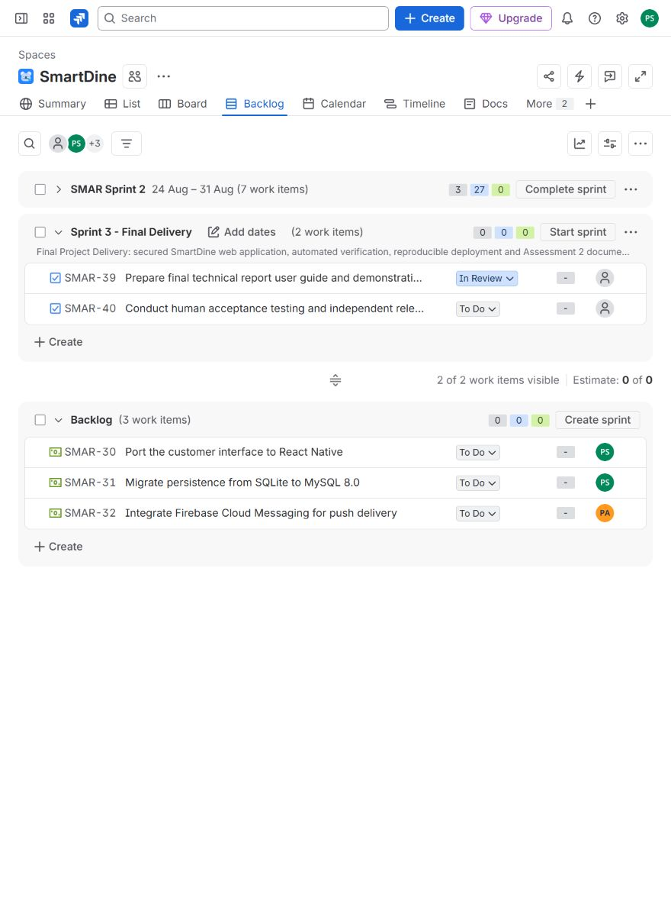

# SmartDine GitHub and Jira Evidence

## Verified delivery snapshot
This snapshot was checked on 5 October 2026 during document review. The final handoff records any later documentation commit and release-state change. Done indicates the named implementation and verification exist; it does not represent an independent human approval.

Repository: https://github.com/arlpramesh7/ICT308

Pull request 2: https://github.com/arlpramesh7/ICT308/pull/2

Jira board: https://sajal-niroula.atlassian.net/jira/software/projects/SMAR/boards/2

Branch: feature/SMAR-36-final-delivery. The provisional local branch feature/final-delivery was renamed before publication. Original history from e1a3ca1 remains intact.

## Issue traceability
| Issue | Work | Evidence | Status at review |
|---|---|---|---|
| SMAR-33 | Existing staff portal task | Menu CRUD and promotions; browser and API checks | Done |
| SMAR-34 | Existing CI task | Executed Actions workflow | Done |
| SMAR-35 | Existing API testing task | 82 passing tests including 49 HTTP tests | Done |
| SMAR-36 | New security defect | Customer-only registration; venue-scoped authorization | Done |
| SMAR-37 | New customer and owner interfaces | Preferences, discovery, account privacy, analytics | Done |
| SMAR-38 | New deployment and performance task | Clean clone and 400-request benchmark | Done |
| SMAR-39 | New documentation task | Report, guide, evidence, demo and 50 Q&A; layout review underway | In Review |
| SMAR-40 | New human acceptance and review task | UAT protocol prepared; no participant or approval invented | To Do |

Existing issues were reused where they matched real work. Descriptions and acceptance criteria were updated; implementation items moved through In Progress and In Review before Done. New issue IDs were assigned by Jira, not predetermined. Existing assignees were preserved. New work is not falsely attributed to another member.

## Sprint handling
The existing active Sprint 2 and backlog were inspected first. Sprint 40, named Sprint 3 - Final Delivery, groups final work. Jira limited names to thirty characters. This is a future sprint container: no historical dates, completion report or velocity were fabricated. The backlog hides completed future-sprint items; the issue records above retain their real Done statuses. Native mobile, MySQL and Firebase proposals remain deferred rather than being marked implemented.

## New commits at this snapshot
- 8a7de13139980ddafb86e693fb149c4b0a1b410e: SMAR-36 Secure roles sessions and restaurant-scoped API access
- ccec2e09bf72990a0790c7c59769d6ba6f2bc591: SMAR-33 SMAR-37 Complete responsive customer staff and owner workflows
- f0b6b294dffd02021b638df6c8986a7f6edaef3f: SMAR-35 Add API security and recommendation regression tests
- 57577550efdae6d462e1f9eab45be1d09c660cb9: SMAR-34 SMAR-38 Run CI verification and isolated latency benchmarks
- e80b7541db9f3be0313785fc87653afdafaf41e1: SMAR-37 Preserve account actions when optional push cleanup fails

All five commits were pushed using the genuine authenticated GitHub identity, sthaprajwal246. No historical commit dates or authors were rewritten. The documentation commit is recorded in the final handoff after this snapshot.

## CI and review
Initial successful verification: https://github.com/arlpramesh7/ICT308/actions/runs/37212127823

Successful verification for e80b754: https://github.com/arlpramesh7/ICT308/actions/runs/37257270627

The workflow installs locked dependencies, runs tests, checks production dependencies and executes the isolated performance runner. The initial Ubuntu run passed all steps. Local clean-install and benchmark results are retained separately; CI timing is not substituted for the reported Windows measurements.

The integration's PR endpoint returned 403 Resource not accessible by integration even though normal Git push was authorized. PR 2 was therefore created through the user's authenticated GitHub browser session as a draft while documents were reviewed. This was an actual PR creation, not an invented review. No independent approval is claimed. Human review and lecturer access must be confirmed separately; connection access does not establish lecturer access.
