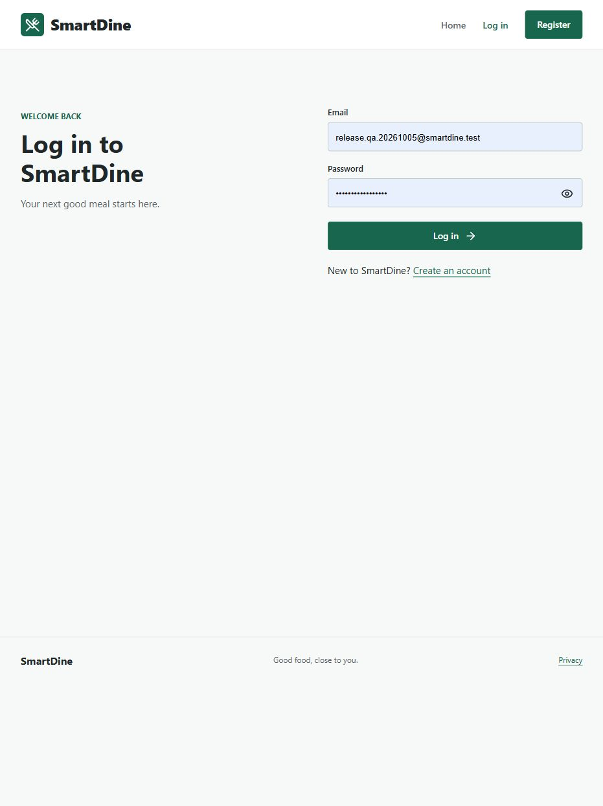
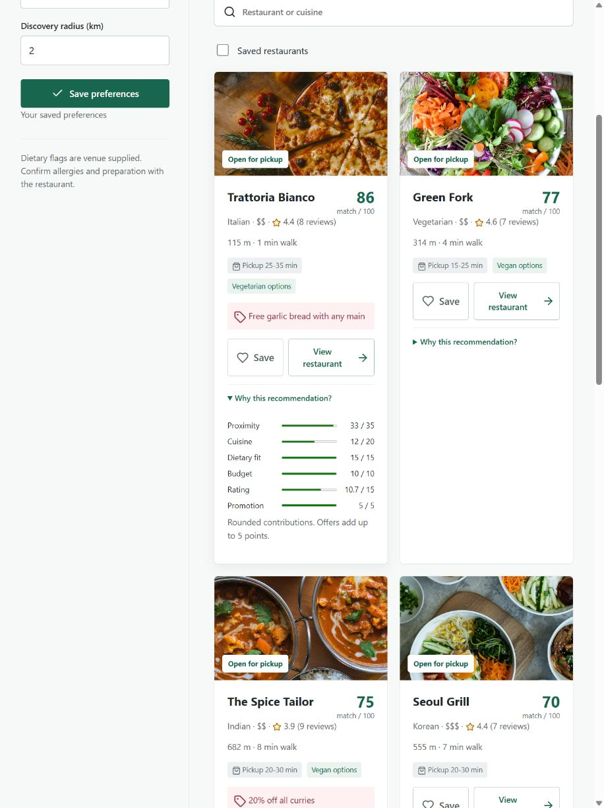
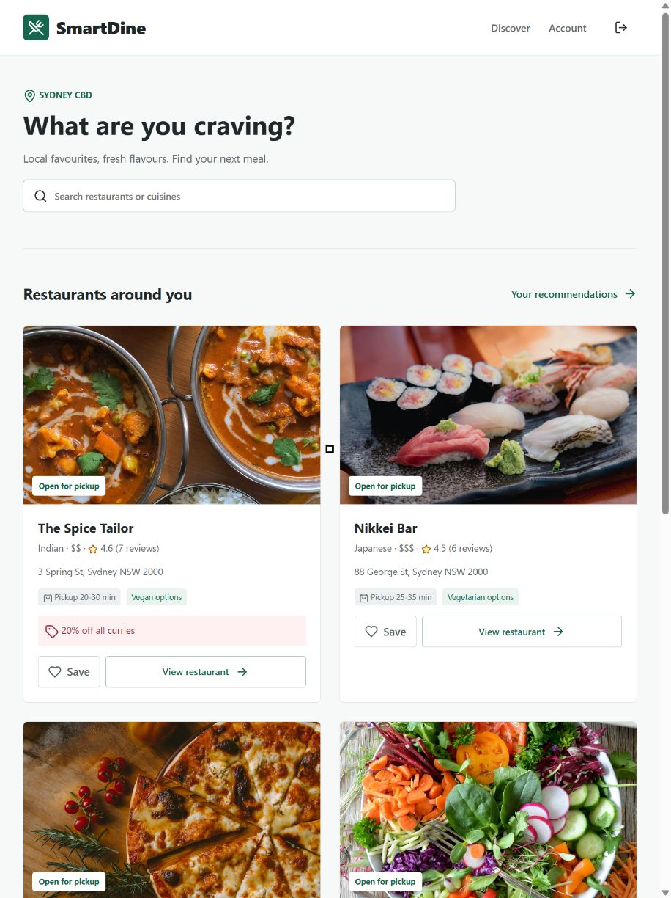
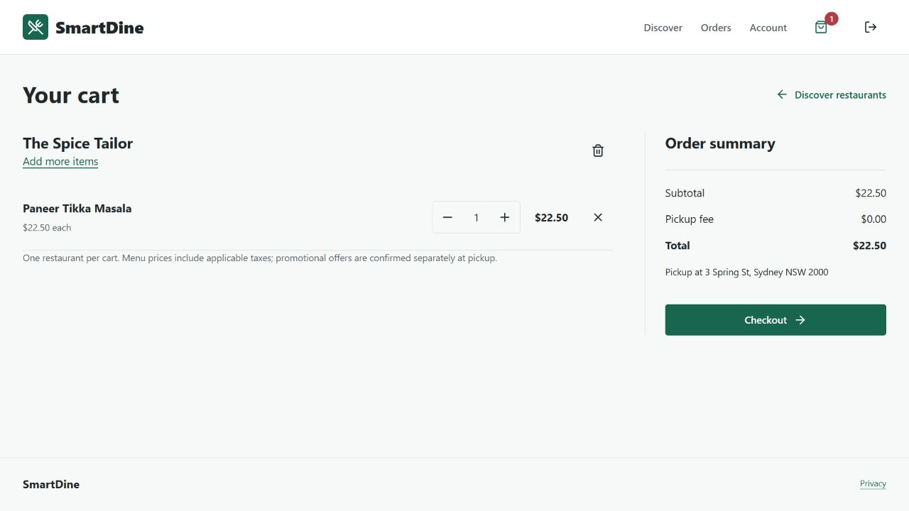
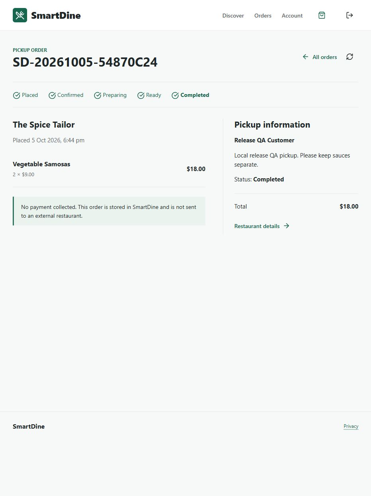
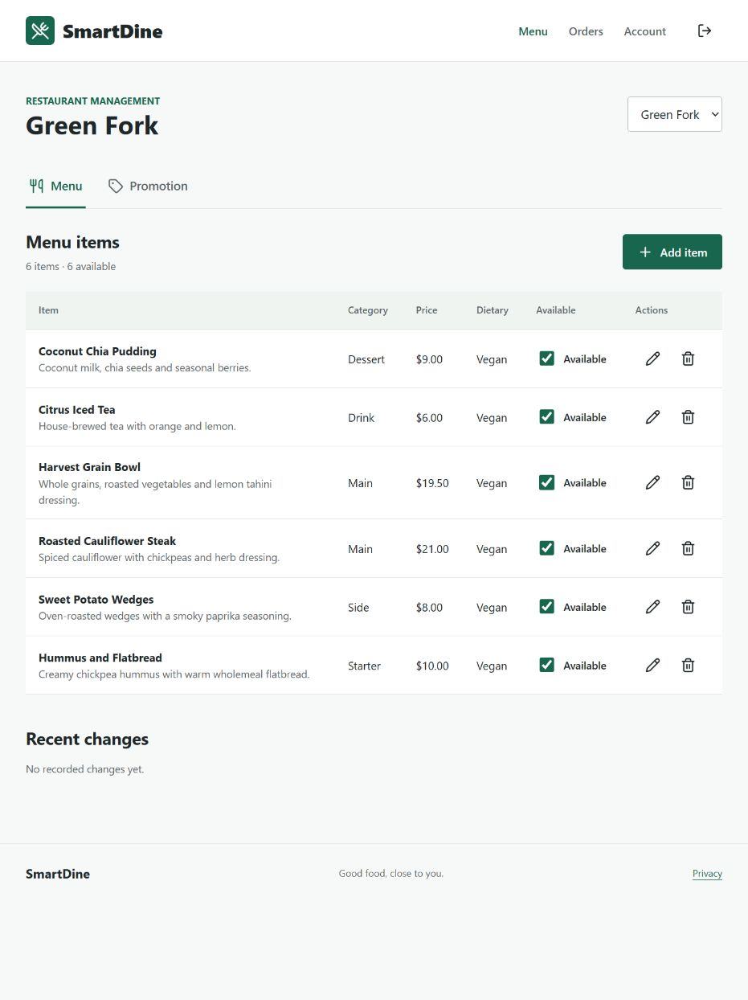
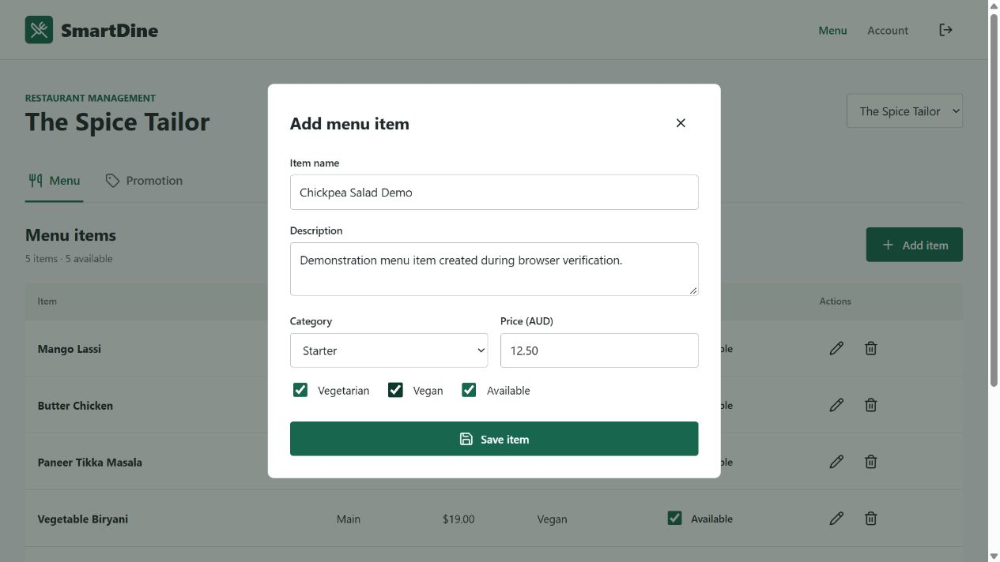
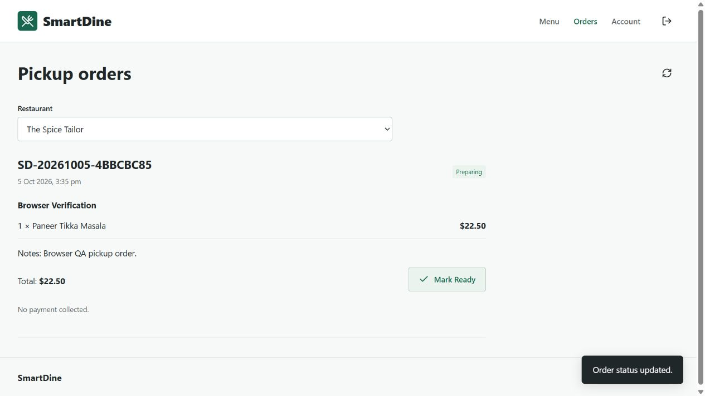
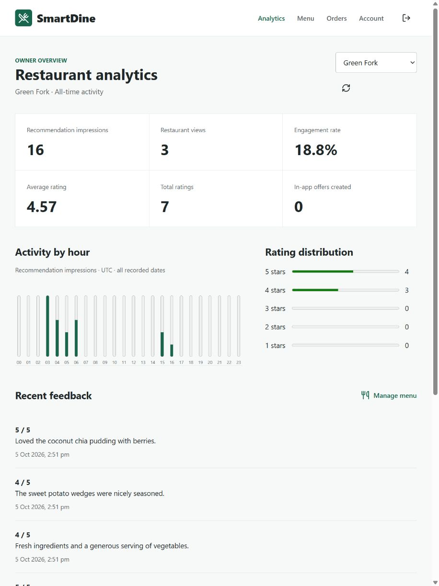
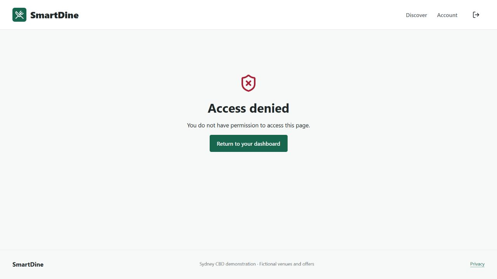

# SmartDine User Guide

## 1 Purpose
SmartDine helps a customer compare nearby demonstration restaurants using preferences, distance, ratings and offers. Staff maintain their assigned restaurant's menu and promotions; owners inspect recorded engagement. This guide covers installation and the complete browser demonstration. All venues, menu examples and offers are educational fixtures, not a live restaurant service.

## 2 System requirements
Use Node.js 24 and npm, Git for cloning, and a current JavaScript-enabled browser. The verified computer ran Windows 11 and Node.js 24.19.0 with 31.7 GiB RAM; this is the measured environment, not a minimum memory requirement. Allow approximately 250 MB for source, dependencies and local data. Internet is needed for installation, GitHub/Jira, external directions and optional push; the main application then runs locally. GPS/push depend on browser support and permission. No Python, MySQL, Redis or Firebase account is required.

## 3 Installation
Open PowerShell or a terminal in a suitable working folder:
```powershell
git clone https://github.com/arlpramesh7/ICT308.git
cd ICT308
git checkout main
npm ci
npm run setup
npm start
```
The release is on main; PR #2 records the earlier delivery and PR #3 the restaurant-account increment. Open http://localhost:4000. The same Express process serves the frontend and API. Do not double-click the HTML file or start a second frontend server. Stop the server with Ctrl+C.

## 4 Configuration and data
Setup generates backend/.env with unique local signing/push keys. Do not share that file. The default port is 4000 and the default origin is http://localhost:4000. If occupied, choose an unused port and change both PORT and APP_ORIGIN before restarting. Keep HOST=127.0.0.1 for a local demonstration.

The database lives in backend/db/smartdine.sqlite. Startup creates missing tables/columns without resetting existing data. Repeating setup preserves existing accounts and content. Back up the database and .env privately before making administrative changes. Never commit database files or secrets.

## 5 Demonstration accounts
| Role | Email | Password |
|---|---|---|
| Customer | customer@smartdine.test | SmartDine-Demo26! |
| Staff | staff@smartdine.test | SmartDine-Demo26! |
| Owner | owner@smartdine.test | SmartDine-Demo26! |

The generic staff/owner aliases above remain assigned to The Spice Tailor. For another venue, use its exclusive account below. Every account uses the public local password SmartDine-Demo26! and displays the venue name followed by Staff or Owner.

| Restaurant | Staff email | Owner email |
|---|---|---|
| The Spice Tailor | staff.the-spice-tailor@smartdine.test | owner.the-spice-tailor@smartdine.test |
| Nikkei Bar | staff.nikkei-bar@smartdine.test | owner.nikkei-bar@smartdine.test |
| Trattoria Bianco | staff.trattoria-bianco@smartdine.test | owner.trattoria-bianco@smartdine.test |
| Green Fork | staff.green-fork@smartdine.test | owner.green-fork@smartdine.test |
| Chophouse | staff.chophouse@smartdine.test | owner.chophouse@smartdine.test |
| Seoul Grill | staff.seoul-grill@smartdine.test | owner.seoul-grill@smartdine.test |

Each privileged account has exactly one restaurant membership. Setup creates/reconciles these through the normal seed mechanism, preserves personal data/passwords and refuses conflicting privileged roles, passwords or memberships rather than silently changing access. Provisioning is disabled in production or with DEMO_DATA=false. The local customer displays Prajwal Shrestha but is distinct from personal accounts. Discovery, Account and pickup defaults use the authenticated profile. Public registration creates customers only; no admin role exists.

## 6 Customer workflow
### Registration and login
From Home, choose Register. Enter a unique name of 3–50 characters, valid email and a password of at least 10 characters and no more than 72 bytes; confirm the password and acknowledge the privacy notice. Successful registration opens Discover. No staff or owner selector is offered. Existing users choose Log in. Incorrect credentials show an error; five failures lock the account for 15 minutes. Sessions last one hour. Log out before switching roles.



### Preferences
Select Indian, Vegetarian, $$ and a radius of 2 km, then Save preferences. The confirmation indicates database persistence. Reloading retains the values. Any cuisine/budget and No restriction remove those preferences; vegan is a distinct restriction. Supported radius is 0.1–50 km. Venue-supplied flags do not guarantee allergy safety or prevent cross-contamination.

### Location and geofencing
Use the Search area menu for a predictable local demonstration:
1. Town Hall is outside the pilot's 200 m geofence.
2. Spring Street is approximately 14 m from the seeded pilot coordinate and inside its geofence.
3. Circular Quay provides another outside-pilot location.
4. Parramatta is outside the 2 km discovery area and should show no matches.

The named search areas use fixed coordinates, not detected GPS. Use my location requests the browser's permission. A denial or failure leaves area selection available. Precise coordinates are used for the request, not saved as a location-history table. Geofencing is evaluated when a location is submitted, not continuously in the background.

### Recommendations and explanation
Each venue shows cuisine, price band, distance, estimated straight-line walking time, rating and any currently active offer. Select Why this recommendation? to see the six contributions returned by the server. They use proximity 35, cuisine 20, dietary 15, price 10, rating 15 and promotion 5. The displayed score is rounded separately from its components. It is a match score, not a probability or guarantee of satisfaction.

Select vegan and save again. Only compatible venues remain; excluded venue names are shown below the results. Radius and dietary restrictions exclude candidates; cuisine and budget rank them and do not guarantee only exact matches. Search matches restaurant names/cuisines. No minimum-rating filter is implemented. A no-results message is expected at an out-of-area search location. The refresh icon repeats the current search.



### Restaurant pages, favourites and reviews
Select a restaurant photograph, name or View restaurant. The dedicated page shows cuisine imagery, address, opening hours, pickup estimate, full grouped menu, prices and dietary flags. Unavailable items are labelled and have no Add to Cart control. The heart turns red and filled when saved; select it again to remove. Reloading and signing back into the same account preserve the choice. Saved restaurants on Discover filters your saved list, including venues outside the current search radius.

Browse reviews with the previous/next arrows. Your own existing review is loaded into the rating form; saving updates the effective vote. Initial sample reviews are disclosed in the privacy notice. Directions opens an external Google Maps route. The detail page supplies the venue destination; opening a link transmits its coordinates to Google. SmartDine's approximate walk time is not a road-network route estimate.



### Cart and pickup checkout
1. On the restaurant menu, select the plus button for an available item. The cart icon shows the number of units. Your account's cart is saved in SQLite, not shared with another customer.
2. Open Cart. Increase/decrease quantities or remove an item with the cross icon. Decreasing a quantity of one removes that item. Clear cart uses the trash icon. One restaurant is allowed per cart. Adding from another restaurant opens a confirmation: Cancel preserves the old cart; Clear cart & add item replaces it atomically only after confirmation. A failed add or changed cart does not discard existing items. Limits are 20 units per item and 50 per order.
3. Check item prices, subtotal, zero pickup fee and total in AUD. Current menu prices include applicable taxes. Free-text promotions are confirmed separately at pickup and are not automatically deducted.
4. Select Checkout during the restaurant's opening hours. Pickup is the only supported mode; no delivery selector is offered. The pickup name defaults from your profile. Phone and notes are optional. Leave phone blank, or use an Australian format such as 0400 123 456 or +61 400 123 456. Invalid text shows Enter a valid phone number or leave this field blank near the focused field. Do not enter sensitive information.
5. Read the pay-at-pickup notice: no online payment is collected; orders stay in SmartDine's restaurant portal and are not transmitted to an external restaurant service. Acknowledge it, then Place order. A unique order number and confirmation appear; the cart clears only after the transaction succeeds. Repeated retries use the same key and do not create duplicate orders.
6. Orders lists your persisted order history. Open an order and use Refresh order status to see Placed, Confirmed, Preparing, Ready or Completed. Other customers cannot open it. Staff/owners of the assigned restaurant update the status.

If prices, quantities or availability changed after checkout loaded, return to Cart, review the current total and start checkout again. A closed restaurant or unavailable item prevents ordering. Confirmation is an academic application record, not a paid purchase or a promise of fulfilment by a real restaurant.




### Offers and ratings
An active promotion inside its geofence creates an in-app offer. Your offers shows venue, message, time and unread/read state. The check icon marks it read. Refreshing location within 30 minutes does not create another offer for the same venue. Browser notification permission is not needed for in-app offers.

On a restaurant page, select Rating (1–5), optionally enter Review text up to 500 characters, then Save review. A later rating from the same customer updates the effective rating rather than adding another vote. Do not include personal information in comments. Opening a restaurant and saving it record engagement against the customer's latest recommendation.


## 7 Staff workflow
Log out, then log in as staff. The Menu page lists assigned venues only. Select a venue if more than one is assigned.

Choose Add item. Enter name, description, category and a price from 0 to 9999 AUD with at most two decimal places. Set vegetarian, vegan and availability. Vegan also requires vegetarian; the form assists with this. Save item returns to the updated table. Negative prices and empty names are rejected.

The pencil icon edits an existing item. The availability checkbox enables/disables it without deleting it. The delete icon opens confirmation before permanent removal. Prefer disabling when an item may return. Recent changes records menu and promotion actions. Every server request checks both staff/owner role and venue assignment; changing an ID does not grant access.




Open the Promotion tab. Enter offer text, local start/end dates and Enable promotion. The end must follow the start; an enabled offer needs both dates and nonempty text. Save promotion persists it. Future and expired offers do not receive a recommendation boost or trigger notifications.

### Pickup orders
The Orders navigation opens only orders for an assigned restaurant. Read items, quantities, pickup name, optional phone/notes and total. Mark Confirmed, then Preparing, Ready and Completed in sequence. Refresh before retrying a stale status. Changes persist and have audit entries. These controls do not process payments or transmit orders outside SmartDine.



## 8 Owner workflow
Log out and sign in as owner. Analytics displays the assigned restaurant's actual recommendation impressions, views, engagement percentage, average rating, rating count and in-app offers created. Refresh reads the database again. Activity by hour uses UTC and combines all recorded dates; recent feedback has no customer identity field.

An impression is a venue surfaced to a customer, deduplicated for 10 minutes. A view is an opened/interested recommendation, not a verified physical visit. Engagement equals viewed impressions divided by impressions. A clean database initially shows zero activity and no rating. Perform the customer workflow first to generate genuine demonstration events. Manage menu opens the same protected menu interface. Owners also have the assigned-restaurant Orders screen and can advance pickup status.



## 9 Account and privacy
Account shows the authenticated profile. Customers may disable nearby promotional offers; doing so also removes stored push subscriptions. Export my data downloads JSON containing the customer's own profile, preferences, favourites, cart, orders, ratings and activity without password hashes, retry keys or private keys.

Enable browser alerts is optional. It requires a supporting browser, permission, configured keys and reachable provider. If unavailable or denied, in-app offers continue to work when enabled. Disable browser alerts removes this device subscription. Do not promise native background geofencing: the customer must submit a location to trigger an offer.

Clear recommendation history requires confirmation and removes recommendations/offers, changing subsequent analytics. Delete my account requires the current password and the exact word DELETE; it permanently removes the account and related personal records. Export first if needed. Never delete a team/demo account during the assessed presentation. Independent tests verify deletion using isolated fixtures.

## 10 Security demonstration
While logged in as customer, open /owner.html or /staff.html. The interface displays Access denied. Explain that this screen is only user feedback: API tests separately demonstrate HTTP 403 for customer access and unassigned venue mutation. Public registration rejects owner/staff requests even if a client manually supplies a role.



## 11 Troubleshooting
| Symptom | Action |
|---|---|
| node command unavailable | Install Node.js 24, reopen the terminal and check node --version |
| Missing secret error | Run npm run setup; never substitute a committed production secret |
| Address already in use | Stop only your previous SmartDine server, or change PORT and APP_ORIGIN together |
| Network error in page | Confirm npm start is running and open the configured localhost origin |
| Login fails | Use exact demo credentials; wait 15 minutes after a lockout; setup does not overwrite existing passwords |
| No recommendations | Choose a named CBD search area and suitable radius/dietary options |
| No new offer | Confirm active dates, inside-geofence location, offer preference and 30-minute cooldown |
| Empty owner metrics | Generate customer interactions first; there are no invented metrics |
| Browser push unavailable | Keep in-app offers; check browser support/permission and network later |
| Session expired | Log in again; unsaved form input may need re-entry |
| GPS denied | Choose a named search area |

## 12 Verification and limitations
Run npm test for the isolated automated suite and npm run test:performance for a separate local benchmark. Tests do not need the demonstration server and do not erase its database. Saved evidence is in docs/evidence.

This release provides persisted pickup orders, not real payments or external restaurant fulfilment. It does not provide delivery/drivers/live tracking, booking, native mobile/background GPS, email verification/password reset, production HTTPS hosting or guaranteed push delivery. Dietary flags and sample restaurants are fixtures. Human UAT and lecturer access checks must be completed by actual people; no usability score or production uptime is implied.
